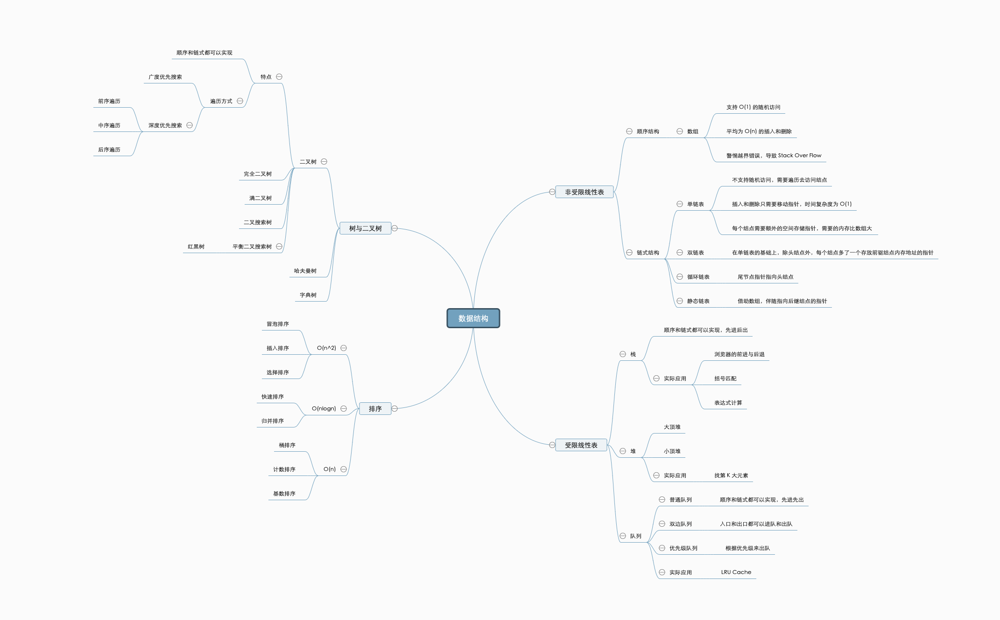
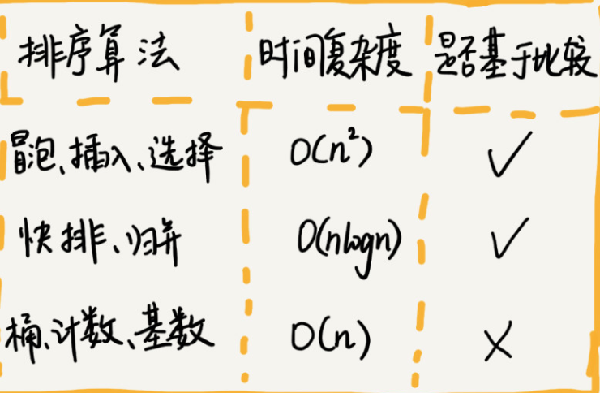

# 数据结构与算法

参考资料：[数据结构与算法之美](https://time.geekbang.org/column/article/40036)



10 个数据结构：数组、链表、栈、队列、散列表、二叉树、堆、跳表、图、Trie 树；
10 个算法：递归、排序、二分查找、搜索、哈希算法、贪心算法、分治算法、回溯算法、动态规划、字符串匹配算法。

## 1. 复杂度分析

### 1.1. 时间复杂度

#### 1.1.1. 大 O 复杂度表示法

算法的执行效率，粗略地讲，就是算法代码执行的时间。

```java

 int cal(int n) {
   int sum = 0;
   int i = 1;
   for (; i <= n; ++i) {
     sum = sum + i;
   }
   return sum;
 }
```

从 CPU 的角度来看，这段代码的每一行都执行着类似的操作：读数据-运算-写数据。尽管每行代码对应的 CPU 执行的个数、执行的时间都不一样，但是，我们这里只是粗略估计，所以可以假设每行代码执行的时间都一样，为 unit_time。在这个假设的基础之上，这段代码的总执行时间是多少呢？第 2、3 行代码分别需要 1 个 unit_time 的执行时间，第 4、5 行都运行了 n 遍，所以需要 2n*unit_time 的执行时间，所以这段代码总的执行时间就是 (2n+2)*unit_time。可以看出来，所有代码的执行时间 T(n) 与每行代码的执行次数成正比。

```java

 int cal(int n) {
   int sum = 0;
   int i = 1;
   int j = 1;
   for (; i <= n; ++i) {
     j = 1;
     for (; j <= n; ++j) {
       sum = sum +  i * j;
     }
   }
 }
```

我们依旧假设每个语句的执行时间是 unit_time。那这段代码的总执行时间 T(n) 是多少呢？第 2、3、4 行代码，每行都需要 1 个 unit_time 的执行时间，第 5、6 行代码循环执行了 n 遍，需要 2n * unit_time 的执行时间，第 7、8 行代码循环执行了 n2遍，所以需要 2n2* unit_time 的执行时间。所以，整段代码总的执行时间 T(n) = (2n2+2n+3)*unit_time。尽管我们不知道 unit_time 的具体值，但是通过这两段代码执行时间的推导过程，我们可以得到一个非常重要的规律，那就是，所有代码的执行时间 T(n) 与每行代码的执行次数 n 成正比。我们可以把这个规律总结成一个公式。

```text
T(n) = O(f(n))
```

T(n) 它表示代码执行的时间；n 表示数据规模的大小；f(n) 表示每行代码执行的次数总和。因为这是一个公式，所以用 f(n) 来表示。公式中的 O，表示代码的执行时间 T(n) 与 f(n) 表达式成正比。

第一个例子中的 T(n) = O(2n+2)，第二个例子中的 T(n) = O(2n2+2n+3)。这就是大 O 时间复杂度表示法。大 O 时间复杂度实际上并不具体表示代码真正的执行时间，而是表示代码执行时间随数据规模增长的变化趋势，所以，也叫作渐进时间复杂度（asymptotic time complexity），简称时间复杂度。


#### 1.1.2. 时间复杂度分析

1. 只关注循环执行次数最多的一段代码

```java

 int cal(int n) {
   int sum = 0;
   int i = 1;
   for (; i <= n; ++i) {
     sum = sum + i;
   }
   return sum;
 }
```

其中第 2、3 行代码都是常量级的执行时间，与 n 的大小无关，所以对于复杂度并没有影响。循环执行次数最多的是第 4、5 行代码，所以这块代码要重点分析。前面我们也讲过，这两行代码被执行了 n 次，所以总的时间复杂度就是 O(n)。

2. 加法法则：总复杂度等于量级最大的那段代码的复杂度

```java
int cal(int n) {
   int sum_1 = 0;
   int p = 1;
   for (; p < 100; ++p) {
     sum_1 = sum_1 + p;
   }

   int sum_2 = 0;
   int q = 1;
   for (; q < n; ++q) {
     sum_2 = sum_2 + q;
   }
 
   int sum_3 = 0;
   int i = 1;
   int j = 1;
   for (; i <= n; ++i) {
     j = 1; 
     for (; j <= n; ++j) {
       sum_3 = sum_3 +  i * j;
     }
   }
 
   return sum_1 + sum_2 + sum_3;
 }
```

这三段代码的时间复杂度，我们取其中最大的量级。所以，整段代码的时间复杂度就为 O(n2)。也就是说：总的时间复杂度就等于量级最大的那段代码的时间复杂度。那我们将这个规律抽象成公式就是：
如果 T1(n)=O(f(n))，T2(n)=O(g(n))；那么 T(n)=T1(n)+T2(n)=max(O(f(n)), O(g(n))) =O(max(f(n), g(n))).

3. 乘法法则：嵌套代码的复杂度等于嵌套内外代码复杂度的乘积

如果 T1(n)=O(f(n))，T2(n)=O(g(n))；那么 T(n)=T1(n)*T2(n)=O(f(n))*O(g(n))=O(f(n)*g(n)).也就是说，假设 T1(n) = O(n)，T2(n) = O(n2)，则 T1(n) * T2(n) = O(n3)。落实到具体的代码上，我们可以把乘法法则看成是嵌套循环


```java

int cal(int n) {
   int ret = 0; 
   int i = 1;
   for (; i < n; ++i) {
     ret = ret + f(i);
   } 
 } 
 
 int f(int n) {
  int sum = 0;
  int i = 1;
  for (; i < n; ++i) {
    sum = sum + i;
  } 
  return sum;
 }
```

独看 cal() 函数。假设 f() 只是一个普通的操作，那第 4～6 行的时间复杂度就是，T1(n) = O(n)。但 f() 函数本身不是一个简单的操作，它的时间复杂度是 T2(n) = O(n)，所以，整个 cal() 函数的时间复杂度就是，T(n) = T1(n) * T2(n) = O(n*n) = O(n2)。


#### 1.1.3. 多项式时间复杂度

1. O(1)

O(1) 只是常量级时间复杂度的一种表示方法，并不是指只执行了一行代码。比如这段代码，即便有 3 行，它的时间复杂度也是 O(1），而不是 O(3)。 

```java
int i = 8; 
int j = 6; 
int sum = i + j;
```

只要代码的执行时间不随 n 的增大而增长，这样代码的时间复杂度我们都记作 O(1)。或者说，一般情况下，只要算法中不存在循环语句、递归语句，即使有成千上万行的代码，其时间复杂度也是Ο(1)。

2.  O(logn)、O(nlogn)

对数阶时间复杂度非常常见，同时也是最难分析的一种时间复杂度。我通过一个例子来说明一下。

```java
 i=1; 
 while (i <= n)  {  
      i = i * 2;
       }
```

第三行代码是循环执行次数最多的。所以，我们只要能计算出这行代码被执行了多少次，就能知道整段代码的时间复杂度。从代码中可以看出，变量 i 的值从 1 开始取，每循环一次就乘以 2。当大于 n 时，循环结束。等比数列,通过 2x=n 求解 x=log2n，所以，这段代码的时间复杂度就是 O(log2n)。

实际上，不管是以 2 为底、以 3 为底，还是以 10 为底，我们可以把所有对数阶的时间复杂度都记为 O(logn)。


3.  O(m+n)、O(m*n)

我们再来讲一种跟前面都不一样的时间复杂度，代码的复杂度由两个数据的规模来决定。

```java

int cal(int m, int n) {
  int sum_1 = 0;
  int i = 1;
  for (; i < m; ++i) {
    sum_1 = sum_1 + i;
  }

  int sum_2 = 0;
  int j = 1;
  for (; j < n; ++j) {
    sum_2 = sum_2 + j;
  }

  return sum_1 + sum_2;
}
```

m 和 n 是表示两个数据规模。我们无法事先评估 m 和 n 谁的量级大，所以我们在表示复杂度的时候，就不能简单地利用加法法则，省略掉其中一个。所以，上面代码的时间复杂度就是 O(m+n)。

针对这种情况，原来的加法法则就不正确了，我们需要将加法规则改为：T1(m) + T2(n) = O(f(m) + g(n))。但是乘法法则继续有效：T1(m)*T2(n) = O(f(m) * f(n))。

### 1.2. 空间复杂度

空间复杂度全称就是渐进空间复杂度（asymptotic space complexity），表示算法的存储空间与数据规模之间的增长关系。

```java

void print(int n) {
  int i = 0;
  int[] a = new int[n];
  for (i; i <n; ++i) {
    a[i] = i * i;
  }

  for (i = n-1; i >= 0; --i) {
    print out a[i]
  }
}
```

第 2 行代码中，我们申请了一个空间存储变量 i，但是它是常量阶的，跟数据规模 n 没有关系，所以我们可以忽略。第 3 行申请了一个大小为 n 的 int 类型数组，除此之外，剩下的代码都没有占用更多的空间，所以整段代码的空间复杂度就是 O(n)。

常见的空间复杂度就是 O(1)、O(n)、O(n2)，像 O(logn)、O(nlogn) 这样的对数阶复杂度平时都用不到。而且，空间复杂度分析比时间复杂度分析要简单很多。

常见的复杂度并不多，从低阶到高阶有：O(1)、O(logn)、O(n)、O(nlogn)、O(n2)。

### 1.3. 最好、最坏情况时间复杂度

要查找的变量 x 可能出现在数组的任意位置。如果数组中第一个元素正好是要查找的变量 x，那就不需要继续遍历剩下的 n-1 个数据了，那时间复杂度就是 O(1)。但如果数组中不存在变量 x，那我们就需要把整个数组都遍历一遍，时间复杂度就成了 O(n)。所以，不同的情况下，这段代码的时间复杂度是不一样的。为了表示代码在不同情况下的不同时间复杂度，我们需要引入三个概念：最好情况时间复杂度、最坏情况时间复杂度和平均情况时间复杂度。

```java

// n表示数组array的长度
int find(int[] array, int n, int x) {
  int i = 0;
  int pos = -1;
  for (; i < n; ++i) {
    if (array[i] == x) {
       pos = i;
       break;
    }
  }
  return pos;
}
```

最好情况时间复杂度就是，在最理想的情况下，执行这段代码的时间复杂度。就像我们刚刚讲到的，在最理想的情况下，要查找的变量 x 正好是数组的第一个元素，这个时候对应的时间复杂度就是最好情况时间复杂度。同理，最坏情况时间复杂度就是，在最糟糕的情况下，执行这段代码的时间复杂度。就像刚举的那个例子，如果数组中没有要查找的变量 x，我们需要把整个数组都遍历一遍才行，所以这种最糟糕情况下对应的时间复杂度就是最坏情况时间复杂度。


### 1.4. 平均情况时间复杂度

要查找的变量 x 在数组中的位置，有 n+1 种情况：在数组的 0～n-1 位置中和不在数组中。我们把每种情况下，查找需要遍历的元素个数累加起来，然后再除以 n+1，就可以得到需要遍历的元素个数的平均值

```text
(1+2+...+ n +n)/(n+1) = n(n+3)/2(n+1)
```

间复杂度的大 O 标记法中，可以省略掉系数、低阶、常量，所以，咱们把刚刚这个公式简化之后，得到的平均时间复杂度就是 O(n)。

### 1.5. 均摊时间复杂度

这段代码实现了一个往数组中插入数据的功能。当数组满了之后，也就是代码中的 count == array.length 时，我们用 for 循环遍历数组求和，并清空数组，将求和之后的 sum 值放到数组的第一个位置，然后再将新的数据插入。但如果数组一开始就有空闲空间，则直接将数据插入数组。

```java

 // array表示一个长度为n的数组
 // 代码中的array.length就等于n
 int[] array = new int[n];
 int count = 0;
 
 void insert(int val) {
    if (count == array.length) {
       int sum = 0;
       for (int i = 0; i < array.length; ++i) {
          sum = sum + array[i];
       }
       array[0] = sum;
       count = 1;
    }

    array[count] = val;
    ++count;
 }
```

在数组中插入数据的这个例子。每一次 O(n) 的插入操作，都会跟着 n-1 次 O(1) 的插入操作，所以把耗时多的那次操作均摊到接下来的 n-1 次耗时少的操作上，均摊下来，这一组连续的操作的均摊时间复杂度就是 O(1)。这就是均摊分析的大致思路。


## 2. 链表

最常见的链表结构：单链表、双向链表和循环链表。

### 2.1 单链表

链表通过指针将一组零散的内存块串联在一起。其中，我们把内存块称为链表的“结点”。为了将所有的结点串起来，每个链表的结点除了存储数据之外，还需要记录链上的下一个结点的地址。如图所示，我们把这个记录下个结点地址的指针叫作后继指针 next。


其中有两个结点是比较特殊的，它们分别是第一个结点和最后一个结点。我们习惯性地把第一个结点叫作头结点，把最后一个结点叫作尾结点。其中，头结点用来记录链表的基地址。有了它，我们就可以遍历得到整条链表。而尾结点特殊的地方是：指针不是指向下一个结点，而是指向一个空地址 NULL，表示这是链表上最后一个结点。

与数组一样，链表也支持数据的查找、插入和删除操作。

在进行数组的插入、删除操作时，为了保持内存数据的连续性，需要做大量的数据搬移，所以时间复杂度是 O(n)。而在链表中插入或者删除一个数据，我们并不需要为了保持内存的连续性而搬移结点，因为链表的存储空间本身就不是连续的。所以，在链表中插入和删除一个数据是非常快速的。

从图中我们可以看出，针对链表的插入和删除操作，我们只需要考虑相邻结点的指针改变，所以对应的时间复杂度是 O(1)。


链表要想随机访问第 k 个元素，就没有数组那么高效了。因为链表中的数据并非连续存储的，所以无法像数组那样，根据首地址和下标，通过寻址公式就能直接计算出对应的内存地址，而是需要根据指针一个结点一个结点地依次遍历，直到找到相应的结点。

链表随机访问的性能没有数组好，需要 O(n) 的时间复杂度


### 2.2 循环链表

它跟单链表唯一的区别就在尾结点。我们知道，单链表的尾结点指针指向空地址，表示这就是最后的结点了。而循环链表的尾结点指针是指向链表的头结点。从我画的循环链表图中，你应该可以看出来，它像一个环一样首尾相连，所以叫作“循环”链表。


和单链表相比，循环链表的优点是从链尾到链头比较方便。当要处理的数据具有环型结构特点时，就特别适合采用循环链表。比如著名的约瑟夫问题。尽管用单链表也可以实现，但是用循环链表实现的话，代码就会简洁很多。

### 2.3 双向链表

支持两个方向，每个结点不止有一个后继指针 next 指向后面的结点，还有一个前驱指针 prev 指向前面的结点。


双向链表需要额外的两个空间来存储后继结点和前驱结点的地址。所以，如果存储同样多的数据，双向链表要比单链表占用更多的内存空间。虽然两个指针比较浪费存储空间，但可以支持双向遍历，这样也带来了双向链表操作的灵活性。那相比单链表，双向链表适合解决哪种问题呢？从结构上来看，双向链表可以支持 O(1) 时间复杂度的情况下找到前驱结点，正是这样的特点，也使双向链表在某些情况下的插入、删除等操作都要比单链表简单、高效。

1. 删除操作。

在实际的软件开发中，从链表中删除一个数据无外乎这两种情况：
- 删除结点中“值等于某个给定值”的结点；
- 删除给定指针指向的结点。

对于第一种情况，不管是单链表还是双向链表，为了查找到值等于给定值的结点，都需要从头结点开始一个一个依次遍历对比，直到找到值等于给定值的结点，然后再通过我前面讲的指针操作将其删除。尽管单纯的删除操作时间复杂度是 O(1)，但遍历查找的时间是主要的耗时点，对应的时间复杂度为 O(n)。根据时间复杂度分析中的加法法则，删除值等于给定值的结点对应的链表操作的总时间复杂度为 O(n)。

对于第二种情况，我们已经找到了要删除的结点，但是删除某个结点 q 需要知道其前驱结点，而单链表并不支持直接获取前驱结点，所以，为了找到前驱结点，我们还是要从头结点开始遍历链表，直到 p->next=q，说明 p 是 q 的前驱结点。但是对于双向链表来说，这种情况就比较有优势了。因为双向链表中的结点已经保存了前驱结点的指针，不需要像单链表那样遍历。所以，针对第二种情况，单链表删除操作需要 O(n) 的时间复杂度，而双向链表只需要在 O(1) 的时间复杂度内就搞定了！

同理，如果我们希望在链表的某个指定结点前面插入一个结点，双向链表比单链表有很大的优势。双向链表可以在 O(1) 时间复杂度搞定，而单向链表需要 O(n) 的时间复杂度。

除了插入、删除操作有优势之外，对于一个有序链表，双向链表的按值查询的效率也要比单链表高一些。因为，我们可以记录上次查找的位置 p，每次查询时，根据要查找的值与 p 的大小关系，决定是往前还是往后查找，所以平均只需要查找一半的数据。


用空间换时间的设计思想。当内存空间充足的时候，如果我们更加追求代码的执行速度，我们就可以选择空间复杂度相对较高、但时间复杂度相对很低的算法或者数据结构。相反，如果内存比较紧缺，比如代码跑在手机或者单片机上，这个时候，就要反过来用时间换空间的设计思路。

缓存实际上就是利用了空间换时间的设计思想。如果我们把数据存储在硬盘上，会比较节省内存，但每次查找数据都要询问一次硬盘，会比较慢。但如果我们通过缓存技术，事先将数据加载在内存中，虽然会比较耗费内存空间，但是每次数据查询的速度就大大提高了。所以我总结一下，对于执行较慢的程序，可以通过消耗更多的内存（空间换时间）来进行优化；而消耗过多内存的程序，可以通过消耗更多的时间（时间换空间）来降低内存的消耗。


### 2.4。 链表 VS 数组性能大比拼

插入、删除、随机访问操作的时间复杂度正好相反。

1. 数组简单易用，在实现上使用的是连续的内存空间，可以借助 CPU 的缓存机制，预读数组中的数据，所以访问效率更高。而链表在内存中并不是连续存储，所以对 CPU 缓存不友好，没办法有效预读。

2. 数组的缺点是大小固定，一经声明就要占用整块连续内存空间。如果声明的数组过大，系统可能没有足够的连续内存空间分配给它，导致“内存不足（out of memory）”。如果声明的数组过小，则可能出现不够用的情况。这时只能再申请一个更大的内存空间，把原数组拷贝进去，非常费时。链表本身没有大小的限制，天然地支持动态扩容，我觉得这也是它与数组最大的区别。

3. 如果代码对内存的使用非常苛刻，那数组就更适合你。因为链表中的每个结点都需要消耗额外的存储空间去存储一份指向下一个结点的指针，所以内存消耗会翻倍。而且，对链表进行频繁的插入、删除操作，还会导致频繁的内存申请和释放，容易造成内存碎片，如果是 Java 语言，就有可能会导致频繁的 GC（Garbage Collection，垃圾回收）。


### 2.5. 如何基于链表实现 LRU 缓存淘汰算法

维护一个有序单链表，越靠近链表尾部的结点是越早之前访问的。当有一个新的数据被访问时，我们从链表头开始顺序遍历链表。

1. 如果此数据之前已经被缓存在链表中了，我们遍历得到这个数据对应的结点，并将其从原来的位置删除，然后再插入到链表的头部。

2. 如果此数据没有在缓存链表中，又可以分为两种情况：如果此时缓存未满，则将此结点直接插入到链表的头部；如果此时缓存已满，则链表尾结点删除，将新的数据结点插入链表的头部。

### 2.6. 写链表代码

1. 理解指针或引用的含义

将某个变量赋值给指针，实际上就是将这个变量的地址赋值给指针，或者反过来说，指针中存储了这个变量的内存地址，指向了这个变量，通过指针就能找到这个变量。

在编写链表代码的时候，我们经常会有这样的代码：p->next=q。这行代码是说，p 结点中的 next 指针存储了 q 结点的内存地址。还有一个更复杂的，也是我们写链表代码经常会用到的：p->next=p->next->next。这行代码表示，p 结点的 next 指针存储了 p 结点的下下一个结点的内存地址。

2. 警惕指针丢失和内存泄漏


```c++
p->next = x;  // 将p的next指针指向x结点；
x->next = p->next;  // 将x的结点的next指针指向b结点；
```


插入结点时，一定要注意操作的顺序，要先将结点 x 的 next 指针指向结点 b，再把结点 a 的 next 指针指向结点 x，这样才不会丢失指针，导致内存泄漏。所以，对于刚刚的插入代码，我们只需要把第 1 行和第 2 行代码的顺序颠倒一下就可以了。

删除链表结点时，也一定要记得手动释放内存空间，否则，也会出现内存泄漏的问题。当然，对于像 Java 这种虚拟机自动管理内存的编程语言来说，就不需要考虑这么多了。


3. 利用哨兵简化实现难度

哨兵结点，在任何时候，不管链表是不是空，head 指针都会一直指向这个哨兵结点。我们也把这种有哨兵结点的链表叫带头链表。相反，没有哨兵结点的链表就叫作不带头链表。

哨兵结点是不存储数据的。因为哨兵结点一直存在，所以插入第一个结点和插入其他结点，删除最后一个结点和删除其他结点，都可以统一为相同的代码实现逻辑了。


代码1

```java

// 在数组a中，查找key，返回key所在的位置
// 其中，n表示数组a的长度
int find(char* a, int n, char key) {
  // 边界条件处理，如果a为空，或者n<=0，说明数组中没有数据，就不用while循环比较了
  if(a == null || n <= 0) {
    return -1;
  }
  
  int i = 0;
  // 这里有两个比较操作：i<n和a[i]==key.
  while (i < n) {
    if (a[i] == key) {
      return i;
    }
    ++i;
  }
  
  return -1;
}
```

代码2

```java

// 在数组a中，查找key，返回key所在的位置
// 其中，n表示数组a的长度
// 我举2个例子，你可以拿例子走一下代码
// a = {4, 2, 3, 5, 9, 6}  n=6 key = 7
// a = {4, 2, 3, 5, 9, 6}  n=6 key = 6
int find(char* a, int n, char key) {
  if(a == null || n <= 0) {
    return -1;
  }
  
  // 这里因为要将a[n-1]的值替换成key，所以要特殊处理这个值
  if (a[n-1] == key) {
    return n-1;
  }
  
  // 把a[n-1]的值临时保存在变量tmp中，以便之后恢复。tmp=6。
  // 之所以这样做的目的是：希望find()代码不要改变a数组中的内容
  char tmp = a[n-1];
  // 把key的值放到a[n-1]中，此时a = {4, 2, 3, 5, 9, 7}
  a[n-1] = key;
  
  int i = 0;
  // while 循环比起代码一，少了i<n这个比较操作
  while (a[i] != key) {
    ++i;
  }
  
  // 恢复a[n-1]原来的值,此时a= {4, 2, 3, 5, 9, 6}
  a[n-1] = tmp;
  
  if (i == n-1) {
    // 如果i == n-1说明，在0...n-2之间都没有key，所以返回-1
    return -1;
  } else {
    // 否则，返回i，就是等于key值的元素的下标
    return i;
  }
}
```
对比两段代码，在字符串 a 很长的时候，比如几万、几十万，你觉得哪段代码运行得更快点呢？答案是代码二，因为两段代码中执行次数最多就是 while 循环那一部分。第二段代码中，我们通过一个哨兵 a[n-1] = key，成功省掉了一个比较语句 i< n，不要小看这一条语句，当累积执行万次、几十万次时，累积的时间就很明显


4. 重点留意边界条件处理

检查链表代码是否正确的边界条件有这样几个：
- 如果链表为空时，代码是否能正常工作？
- 如果链表只包含一个结点时，代码是否能正常工作？
- 如果链表只包含两个结点时，代码是否能正常工作？
- 代码逻辑在处理头结点和尾结点的时候，是否能正常工作


5. 举例画图，辅助思考

找一个具体的例子，把它画在纸上，释放一些脑容量，留更多的给逻辑思考，这样就会感觉到思路清晰很多。比如往单链表中插入一个数据这样一个操作，我一般都是把各种情况都举一个例子，画出插入前和插入后的链表变化，如图所示：


6. 常见链表操作

- 单链表反转
- 链表中环的检测
- 两个有序的链表合并
- 删除链表倒数第 n 个结点
- 求链表的中间结点


## 3. 栈

有一个非常贴切的例子，就是一摞叠在一起的盘子。我们平时放盘子的时候，都是从下往上一个一个放；取的时候，我们也是从上往下一个一个地依次取，不能从中间任意抽出。后进者先出，先进者后出，这就是典型的“栈”结构。

从栈的操作特性上来看，栈是一种“操作受限”的线性表，只允许在一端插入和删除数据。

当某个数据集合只涉及在一端插入和删除数据，并且满足后进先出、先进后出的特性，我们就应该首选“栈”这种数据结构。

### 3.1. 如何实现一个“栈”

栈主要包含两个操作，入栈和出栈，也就是在栈顶插入一个数据和从栈顶删除一个数据。

栈既可以用数组来实现，也可以用链表来实现。用数组实现的栈，我们叫作顺序栈，用链表实现的栈，我们叫作链式栈。

```java

// 基于数组实现的顺序栈
public class ArrayStack {
  private String[] items;  // 数组
  private int count;       // 栈中元素个数
  private int n;           //栈的大小

  // 初始化数组，申请一个大小为n的数组空间
  public ArrayStack(int n) {
    this.items = new String[n];
    this.n = n;
    this.count = 0;
  }

  // 入栈操作
  public boolean push(String item) {
    // 数组空间不够了，直接返回false，入栈失败。
    if (count == n) return false;
    // 将item放到下标为count的位置，并且count加一
    items[count] = item;
    ++count;
    return true;
  }
  
  // 出栈操作
  public String pop() {
    // 栈为空，则直接返回null
    if (count == 0) return null;
    // 返回下标为count-1的数组元素，并且栈中元素个数count减一
    String tmp = items[count-1];
    --count;
    return tmp;
  }
}
```

1. 不管是顺序栈还是链式栈，我们存储数据只需要一个大小为 n 的数组就够了。在入栈和出栈过程中，只需要一两个临时变量存储空间，所以空间复杂度是 O(1)。

这里存储数据需要一个大小为 n 的数组，并不是说空间复杂度就是 O(n)。因为，这 n 个空间是必须的，无法省掉。所以我们说空间复杂度的时候，是指除了原本的数据存储空间外，算法运行还需要额外的存储空间。

2. 不管是顺序栈还是链式栈，入栈、出栈只涉及栈顶个别数据的操作，所以时间复杂度都是 O(1)。支持动态扩容的顺序栈


### 3.2. 支持动态扩容的顺序栈

当数组空间不够时，我们就重新申请一块更大的内存，将原来数组中数据统统拷贝过去。这样就实现了一个支持动态扩容的数组。所以，如果要实现一个支持动态扩容的栈，我们只需要底层依赖一个支持动态扩容的数组就可以了。当栈满了之后，我们就申请一个更大的数组，将原来的数据搬移到新数组中。


对于出栈操作来说，我们不会涉及内存的重新申请和数据的搬移，所以出栈的时间复杂度仍然是 O(1)。但是，对于入栈操作来说，情况就不一样了。当栈中有空闲空间时，入栈操作的时间复杂度为 O(1)。但当空间不够时，就需要重新申请内存和数据搬移，所以时间复杂度就变成了 O(n)。

如果当前栈大小为 K，并且已满，当再有新的数据要入栈时，就需要重新申请 2 倍大小的内存，并且做 K 个数据的搬移操作，然后再入栈。但是，接下来的 K-1 次入栈操作，我们都不需要再重新申请内存和搬移数据，所以这 K-1 次入栈操作都只需要一个 simple-push 操作就可以完成.


K 次入栈操作，总共涉及了 K 个数据的搬移，以及 K 次 simple-push 操作。将 K 个数据搬移均摊到 K 次入栈操作，那每个入栈操作只需要一个数据搬移和一个 simple-push 操作。以此类推，入栈操作的均摊时间复杂度就为 O(1)。

均摊时间复杂度一般都等于最好情况时间复杂度。因为在大部分情况下，入栈操作的时间复杂度 O 都是 O(1)，只有在个别时刻才会退化为 O(n)，所以把耗时多的入栈操作的时间均摊到其他入栈操作上，平均情况下的耗时就接近 O(1)。


### 3.3. 栈在函数调用中的应用

操作系统给每个线程分配了一块独立的内存空间，这块内存被组织成“栈”这种结构, 用来存储函数调用时的临时变量。每进入一个函数，就会将临时变量作为一个栈帧入栈，当被调用函数执行完成，返回之后，将这个函数对应的栈帧出栈。

```java

int main() {
   int a = 1; 
   int ret = 0;
   int res = 0;
   ret = add(3, 5);
   res = a + ret;
   printf("%d", res);
   reuturn 0;
}

int add(int x, int y) {
   int sum = 0;
   sum = x + y;
   return sum;
}
```


### 3.4. 栈在表达式求值中的应用

编译器如何利用栈来实现表达式求值。为了方便解释，我将算术表达式简化为只包含加减乘除四则运算，比如：34+13*9+44-12/3。

对于这个四则运算，编译器就是通过两个栈来实现的。其中一个保存操作数的栈，另一个是保存运算符的栈。我们从左向右遍历表达式，当遇到数字，我们就直接压入操作数栈；当遇到运算符，就与运算符栈的栈顶元素进行比较。

如果比运算符栈顶元素的优先级高，就将当前运算符压入栈；如果比运算符栈顶元素的优先级低或者相同，从运算符栈中取栈顶运算符，从操作数栈的栈顶取 2 个操作数，然后进行计算，再把计算完的结果压入操作数栈，继续比较。


## 4. 队列

先进者先出，入队 enqueue()，放一个数据到队列尾部；出队 dequeue()，从队列头部取一个元素。

作为一种非常基础的数据结构，队列的应用也非常广泛，特别是一些具有某些额外特性的队列，比如循环队列、阻塞队列、并发队列。它们在很多偏底层系统、框架、中间件的开发中，起着关键性的作用。比如高性能队列 Disruptor、Linux 环形缓存，都用到了循环并发队列；Java concurrent 并发包利用 ArrayBlockingQueue 来实现公平锁等。

### 4.1. 顺序队列和链式队列

#### 4.1.1. 基于数组实现队列

队列可以用数组来实现，也可以用链表来实现。用数组实现的队列叫作顺序队列，用链表实现的队列叫作链式队列。

```java

// 用数组实现的队列
public class ArrayQueue {
  // 数组：items，数组大小：n
  private String[] items;
  private int n = 0;
  // head表示队头下标，tail表示队尾下标
  private int head = 0;
  private int tail = 0;

  // 申请一个大小为capacity的数组
  public ArrayQueue(int capacity) {
    items = new String[capacity];
    n = capacity;
  }

  // 入队
  public boolean enqueue(String item) {
    // 如果tail == n 表示队列已经满了
    if (tail == n) return false;
    items[tail] = item;
    ++tail;
    return true;
  }

  // 出队
  public String dequeue() {
    // 如果head == tail 表示队列为空
    if (head == tail) return null;
    // 为了让其他语言的同学看的更加明确，把--操作放到单独一行来写了
    String ret = items[head];
    ++head;
    return ret;
  }
}
```

队列需要两个指针：一个是 head 指针，指向队头；一个是 tail 指针，指向队尾。你可以结合下面这幅图来理解。当 a、b、c、d 依次入队之后，队列中的 head 指针指向下标为 0 的位置，tail 指针指向下标为 4 的位置。


当我们调用两次出队操作之后，队列中 head 指针指向下标为 2 的位置，tail 指针仍然指向下标为 4 的位


随着不停地进行入队、出队操作，head 和 tail 都会持续往后移动。当 tail 移动到最右边，即使数组中还有空闲空间，也无法继续往队列中添加数据了。

我们在出队时可以不用搬移数据。如果没有空闲空间了，我们只需要在入队时，再集中触发一次数据的搬移操作。借助这个思想，出队函数 dequeue() 保持不变，我们稍加改造一下入队函数 enqueue() 的实现，就可以轻松解决刚才的问题了。下面是具体的代码：

```java

   // 入队操作，将item放入队尾
  public boolean enqueue(String item) {
    // tail == n表示队列末尾没有空间了
    if (tail == n) {
      // tail ==n && head==0，表示整个队列都占满了
      if (head == 0) return false;
      // 数据搬移
      for (int i = head; i < tail; ++i) {
        items[i-head] = items[i];
      }
      // 搬移完之后重新更新head和tail
      tail -= head;
      head = 0;
    }
    
    items[tail] = item;
    ++tail;
    return true;
  }
````

当队列的 tail 指针移动到数组的最右边后，如果有新的数据入队，我们可以将 head 到 tail 之间的数据，整体搬移到数组中 0 到 tail-head 的位置。

#### 4.1.2. 基于链表实现队列

需要两个指针：head 指针和 tail 指针。它们分别指向链表的第一个结点和最后一个结点。如图所示，入队时，tail->next= new_node, tail = tail->next；出队时，head = head->next。


### 4.2. 循环队列

长得像一个环。原本数组是有头有尾的，是一条直线。现在我们把首尾相连，扳成了一个环。


图中这个队列的大小为 8，当前 head=4，tail=7。当有一个新的元素 a 入队时，我们放入下标为 7 的位置。但这个时候，我们并不把 tail 更新为 8，而是将其在环中后移一位，到下标为 0 的位置。当再有一个元素 b 入队时，我们将 b 放入下标为 0 的位置，然后 tail 加 1 更新为 1。所以，在 a，b 依次入队之后，循环队列中的元素就变成了下面的样子：


队列为空的判断条件仍然是 head == tail。但队列满的判断条件就稍微有点复杂了。


tail=3，head=4，n=8，所以总结一下规律就是：(3+1)%8=4。多画几张队满的图，你就会发现，当队满时，(tail+1)%n=head。

当队列满时，图中的 tail 指向的位置实际上是没有存储数据的。所以，循环队列会浪费一个数组的存储空间

```java

public class CircularQueue {
  // 数组：items，数组大小：n
  private String[] items;
  private int n = 0;
  // head表示队头下标，tail表示队尾下标
  private int head = 0;
  private int tail = 0;

  // 申请一个大小为capacity的数组
  public CircularQueue(int capacity) {
    items = new String[capacity];
    n = capacity;
  }

  // 入队
  public boolean enqueue(String item) {
    // 队列满了
    if ((tail + 1) % n == head) return false;
    items[tail] = item;
    tail = (tail + 1) % n;
    return true;
  }

  // 出队
  public String dequeue() {
    // 如果head == tail 表示队列为空
    if (head == tail) return null;
    String ret = items[head];
    head = (head + 1) % n;
    return ret;
  }
}
```

### 4.3. 阻塞队列和并发队列

阻塞队列其实就是在队列基础上增加了阻塞操作。简单来说，就是在队列为空的时候，从队头取数据会被阻塞。因为此时还没有数据可取，直到队列中有了数据才能返回；如果队列已经满了，那么插入数据的操作就会被阻塞，直到队列中有空闲位置后再插入数据，然后再返回。


述的定义就是一个“生产者 - 消费者模型”！是的，我们可以使用阻塞队列，轻松实现一个“生产者 - 消费者模型”！这种基于阻塞队列实现的“生产者 - 消费者模型”，可以有效地协调生产和消费的速度。当“生产者”生产数据的速度过快，“消费者”来不及消费时，存储数据的队列很快就会满了。这个时候，生产者就阻塞等待，直到“消费者”消费了数据，“生产者”才会被唤醒继续“生产”。

于阻塞队列，我们还可以通过协调“生产者”和“消费者”的个数，来提高数据的处理效率。


在多线程情况下，会有多个线程同时操作队列，这个时候就会存在线程安全问题，那如何实现一个线程安全的队列呢？线程安全的队列我们叫作并发队列。最简单直接的实现方式是直接在 enqueue()、dequeue() 方法上加锁，但是锁粒度大并发度会比较低，同一时刻仅允许一个存或者取操作。实际上，基于数组的循环队列，利用 CAS 原子操作，可以实现非常高效的并发队列

队列可以应用在任何有限资源池中，用于排队请求，比如数据库连接池等。实际上，对于大部分资源有限的场景，当没有空闲资源时，基本上都可以通过“队列”这种数据结构来实现请求排队。


## 5. 递归

递归需要满足的三个条件

1. 一个问题的解可以分解为几个子问题的解

2. 这个问题与分解之后的子问题，除了数据规模不同，求解思路完全一样

3. 存在递归终止条件


### 5.1. 如何编写递归代码

写递归代码的关键就是找到如何将大问题分解为小问题的规律，并且基于此写出递推公式，然后再推敲终止条件，最后将递推公式和终止条件翻译成代码。

- 例子

```java
//假如这里有 n 个台阶，每次你可以跨 1 个台阶或者 2 个台阶，请问走这 n 个台阶有多少种走法？如果有 7 个台阶，你可以 2，2，2，1 这样子上去，也可以 1，2，1，1，2 这样子上去，总之走法有很多，那如何用编程求得总共有多少种走法呢？

// 可以根据第一步的走法把所有走法分为两类，第一类是第一步走了 1 个台阶，另一类是第一步走了 2 个台阶。所以 n 个台阶的走法就等于先走 1 阶后，n-1 个台阶的走法 加上先走 2 阶后，n-2 个台阶的走法。用公式表示就是：f(n) = f(n-1)+f(n-2)


int f(int n) {
  if (n == 1) return 1;
  if (n == 2) return 2;
  return f(n-1) + f(n-2);
}
```

### 5.2. 递归代码要警惕堆栈溢出

可以通过在代码中限制递归调用的最大深度的方式来解决这个问题。递归调用超过一定深度（比如 1000）之后，我们就不继续往下再递归了，直接返回报错。

```java

// 全局变量，表示递归的深度。
int depth = 0;

int f(int n) {
  ++depth；
  if (depth > 1000) throw exception;
  
  if (n == 1) return 1;
  return f(n-1) + 1;
}
```


### 5.3. 递归代码要警惕重复计算


从图中，我们可以直观地看到，想要计算 f(5)，需要先计算 f(4) 和 f(3)，而计算 f(4) 还需要计算 f(3)，因此，f(3) 就被计算了很多次，这就是重复计算问题。为了避免重复计算，我们可以通过一个数据结构（比如散列表）来保存已经求解过的 f(k)。当递归调用到 f(k) 时，先看下是否已经求解过了。如果是，则直接从散列表中取值返回，不需要重复计算，这样就能避免刚讲的问题了

```java
public int f(int n) {
  if (n == 1) return 1;
  if (n == 2) return 2;
  
  // hasSolvedList可以理解成一个Map，key是n，value是f(n)
  if (hasSolvedList.containsKey(n)) {
    return hasSolvedList.get(n);
  }
  
  int ret = f(n-1) + f(n-2);
  hasSolvedList.put(n, ret);
  return ret;
}
```


### 5.3. 怎么将递归代码改写为非递归代码

递归有利有弊，利是递归代码的表达力很强，写起来非常简洁；而弊就是空间复杂度高、有堆栈溢出的风险、存在重复计算、过多的函数调用会耗时较多等问题。所以，在开发过程中，我们要根据实际情况来选择是否需要用递归的方式来实现。

```java

int f(int n) {
  if (n == 1) return 1;
  if (n == 2) return 2;
  
  int ret = 0;
  int pre = 2;
  int prepre = 1;
  for (int i = 3; i <= n; ++i) {
    ret = pre + prepre;
    prepre = pre;
    pre = ret;
  }
  return ret;
}
```

但是这种思路实际上是将递归改为了“手动”递归，本质并没有变，而且也并没有解决前面讲到的某些问题，徒增了实现的复杂度。


## 6. 排序

最经典的、最常用的：冒泡排序、插入排序、选择排序、归并排序、快速排序、计数排序、基数排序、桶排序。



### 6.1. 如何分析一个“排序算法”？

#### 6.1.1. 排序算法的执行效率

1. 最好情况、最坏情况、平均情况时间复杂度

第一，有些排序算法会区分，为了好对比，所以我们最好都做一下区分。

第二，对于要排序的数据，有的接近有序，有的完全无序。有序度不同的数据，对于排序的执行时间肯定是有影响的，我们要知道排序算法在不同数据下的性能表现。

2.  时间复杂度的系数、常数 、低阶

时间复杂度反应的是数据规模 n 很大的时候的一个增长趋势，所以它表示的时候会忽略系数、常数、低阶。但是实际的软件开发中，我们排序的可能是 10 个、100 个、1000 个这样规模很小的数据，所以，在对同一阶时间复杂度的排序算法性能对比的时候，我们就要把系数、常数、低阶也考虑进来。

3. 比较次数和交换（或移动）次数

基于比较的排序算法的执行过程，会涉及两种操作，一种是元素比较大小，另一种是元素交换或移动。所以，如果我们在分析排序算法的执行效率的时候，应该把比较次数和交换（或移动）次数也考虑进去。

#### 6.1.2. 排序算法的内存消耗

针对排序算法的空间复杂度，还引入了一个新的概念，原地排序（Sorted in place）。原地排序算法，就是特指空间复杂度是 O(1) 的排序算法。

#### 6.1.3. 排序算法的稳定性

仅仅用执行效率和内存消耗来衡量排序算法的好坏是不够的。针对排序算法，我们还有一个重要的度量指标，稳定性。这个概念是说，如果待排序的序列中存在值相等的元素，经过排序之后，相等元素之间原有的先后顺序不变。

比如我们有一组数据 2，9，3，4，8，3，按照大小排序之后就是 2，3，3，4，8，9。这组数据里有两个 3。经过某种排序算法排序之后，如果两个 3 的前后顺序没有改变，那我们就把这种排序算法叫作稳定的排序算法；如果前后顺序发生变化，那对应的排序算法就叫作不稳定的排序算法。


### 6.2. 冒泡排序（Bubble Sort）

冒泡排序只会操作相邻的两个数据。每次冒泡操作都会对相邻的两个元素进行比较，看是否满足大小关系要求。如果不满足就让它俩互换。一次冒泡会让至少一个元素移动到它应该在的位置，重复 n 次，就完成了 n 个数据的排序工作。


要对一组数据 4，5，6，3，2，1，从小到大进行排序。第一次冒泡操作的详细过程如图。


经过一次冒泡操作之后，6 这个元素已经存储在正确的位置上。要想完成所有数据的排序，我们只要进行 6 次这样的冒泡操作就行了。


冒泡过程还可以优化。当某次冒泡操作已经没有数据交换时，说明已经达到完全有序，不用再继续执行后续的冒泡操作。还有另外一个例子，这里面给 6 个元素排序，只需要 4 次冒泡操作就可以了


```java

// 冒泡排序，a表示数组，n表示数组大小
public void bubbleSort(int[] a, int n) {
  if (n <= 1) return;
 
 for (int i = 0; i < n; ++i) {
    // 提前退出冒泡循环的标志位
    boolean flag = false;
    for (int j = 0; j < n - i - 1; ++j) {
      if (a[j] > a[j+1]) { // 交换
        int tmp = a[j];
        a[j] = a[j+1];
        a[j+1] = tmp;
        flag = true;  // 表示有数据交换      
      }
    }
    if (!flag) break;  // 没有数据交换，提前退出
  }
}
```

1. 冒泡的过程只涉及相邻数据的交换操作，只需要常量级的临时空间，所以它的空间复杂度为 O(1)，是一个原地排序算法。

2. 在冒泡排序中，只有交换才可以改变两个元素的前后顺序。为了保证冒泡排序算法的稳定性，当有相邻的两个元素大小相等的时候，我们不做交换，相同大小的数据在排序前后不会改变顺序，所以冒泡排序是稳定的排序算法。

3. 最好情况下，要排序的数据已经是有序的了，我们只需要进行一次冒泡操作，就可以结束了，所以最好情况时间复杂度是 O(n)。而最坏的情况是，要排序的数据刚好是倒序排列的，我们需要进行 n 次冒泡操作，所以最坏情况时间复杂度为 O(n2)。

4. 平均时间复杂度

通过“有序度”和“逆序度”这两个概念来进行分析。有序度是数组中具有有序关系的元素对的个数。有序元素对用数学表达式表示就是这样

```text

有序元素对：a[i] <= a[j], 如果i < j。
```


对于一个倒序排列的数组，比如 6，5，4，3，2，1，有序度是 0；对于一个完全有序的数组，比如 1，2，3，4，5，6，有序度就是 n*(n-1)/2，也就是 15。我们把这种完全有序的数组的有序度叫作满有序度。


逆序度的定义正好跟有序度相反（默认从小到大为有序），逆序元素对：a[i] > a[j], 如果i < j。

逆序度 = 满有序度 - 有序度

对于包含 n 个数据的数组进行冒泡排序，平均交换次数是多少呢？最坏情况下，初始状态的有序度是 0，所以要进行 n*(n-1)/2 次交换。最好情况下，初始状态的有序度是 n*(n-1)/2，就不需要进行交换。我们可以取个中间值 n*(n-1)/4，来表示初始有序度既不是很高也不是很低的平均情况。
这个平均时间复杂度推导过程其实并不严格，但是很多时候很实用，毕竟概率论的定量分析太复杂，不太好用。

### 6.3. 插入排序（Insertion Sort）

一个有序的数组，我们往里面添加一个新的数据后，如何继续保持数据有序呢？很简单，我们只要遍历数组，找到数据应该插入的位置将其插入即可。


这是一个动态排序的过程，即动态地往有序集合中添加数据，我们可以通过这种方法保持集合中的数据一直有序。而对于一组静态数据，我们也可以借鉴上面讲的插入方法，来进行排序，于是就有了插入排序算法。


#### 6.3.1 排序方法

-  首先，我们将数组中的数据分为两个区间，已排序区间和未排序区间。初始已排序区间只有一个元素，就是数组的第一个元素。插入算法的核心思想是取未排序区间中的元素，在已排序区间中找到合适的插入位置将其插入，并保证已排序区间数据一直有序。重复这个过程，直到未排序区间中元素为空，算法结束。


- 插入排序也包含两种操作，一种是元素的比较，一种是元素的移动。当我们需要将一个数据 a 插入到已排序区间时，需要拿 a 与已排序区间的元素依次比较大小，找到合适的插入位置。找到插入点之后，我们还需要将插入点之后的元素顺序往后移动一位，这样才能腾出位置给元素 a 插入。

- 对于不同的查找插入点方法（从头到尾、从尾到头），元素的比较次数是有区别的。但对于一个给定的初始序列，移动操作的次数总是固定的，就等于逆序度。

```java

// 插入排序，a表示数组，n表示数组大小
public void insertionSort(int[] a, int n) {
  if (n <= 1) return;

  for (int i = 1; i < n; ++i) {
    int value = a[i];
    int j = i - 1;
    // 查找插入的位置
    for (; j >= 0; --j) {
      if (a[j] > value) {
        a[j+1] = a[j];  // 数据移动
      } else {
        break;
      }
    }
    a[j+1] = value; // 插入数据
  }
}
```

1. 插入排序算法的运行并不需要额外的存储空间，所以空间复杂度是 O(1)，也就是说，这是一个原地排序算法。

2. 在插入排序中，对于值相同的元素，我们可以选择将后面出现的元素，插入到前面出现元素的后面，这样就可以保持原有的前后顺序不变，所以插入排序是稳定的排序算法。

3. 如果要排序的数据已经是有序的，我们并不需要搬移任何数据。如果我们从尾到头在有序数据组里面查找插入位置，每次只需要比较一个数据就能确定插入的位置。所以这种情况下，最好是时间复杂度为 O(n)。注意，这里是从尾到头遍历已经有序的数据。如果数组是倒序的，每次插入都相当于在数组的第一个位置插入新的数据，所以需要移动大量的数据，所以最坏情况时间复杂度为 O(n2)。

4. 平均时间复杂度,每次插入操作都相当于在数组中插入一个数据，循环执行 n 次插入操作，所以平均时间复杂度为 O(n2)。


### 6.4. 选择排序（Selection Sort）

实现思路有点类似插入排序，也分已排序区间和未排序区间。但是选择排序每次会从未排序区间中找到最小的元素，将其放到已排序区间的末尾


1. 选择排序空间复杂度为 O(1)，是一种原地排序算法。

2. 选择排序是一种不稳定的排序算法。从我前面画的那张图中，你可以看出来，选择排序每次都要找剩余未排序元素中的最小值，并和前面的元素交换位置，这样破坏了稳定性。

3. 选择排序的最好情况时间复杂度、最坏情况和平均情况时间复杂度都为 O(n2)。


### 6.5. 归并排序

适合大规模的数据排序

归并排序的核心思想：如果要排序一个数组，我们先把数组从中间分成前后两部分，然后对前后两部分分别排序，再将排好序的两部分合并在一起，这样整个数组就都有序了。


归并排序使用的就是分治思想。分治，顾名思义，就是分而治之，将一个大问题分解成小的子问题来解决。小的子问题解决了，大问题也就解决了。

分治算法一般都是用递归来实现的。分治是一种解决问题的处理思想，递归是一种编程技巧，


```text

递推公式：
merge_sort(p…r) = merge(merge_sort(p…q), merge_sort(q+1…r))

终止条件：
p >= r 不用再继续分解
```

```java
// 伪代码

// 归并排序算法, A是数组，n表示数组大小
merge_sort(A, n) {
  merge_sort_c(A, 0, n-1)
}

// 递归调用函数
merge_sort_c(A, p, r) {
  // 递归终止条件
  if p >= r  then return

  // 取p到r之间的中间位置q
  q = (p+r) / 2
  // 分治递归
  merge_sort_c(A, p, q)
  merge_sort_c(A, q+1, r)
  // 将A[p...q]和A[q+1...r]合并为A[p...r]
  merge(A[p...r], A[p...q], A[q+1...r])
}
```

merge(A[p…r], A[p…q], A[q+1…r]) 这个函数的作用就是，将已经有序的 A[p…q] 和 A[q+1…r] 合并成一个有序的数组，并且放入 A[p…r]。那这个过程具体该如何做呢？如图所示，我们申请一个临时数组 tmp，大小与 A[p…r] 相同。我们用两个游标 i 和 j，分别指向 A[p…q] 和 A[q+1…r] 的第一个元素。比较这两个元素 A[i] 和 A[j]，如果 A[i]<=A[j]，我们就把 A[i] 放入到临时数组 tmp，并且 i 后移一位，否则将 A[j] 放入到数组 tmp，j 后移一位。


到其中一个子数组中的所有数据都放入临时数组中，再把另一个数组中的数据依次加入到临时数组的末尾，这个时候，临时数组中存储的就是两个子数组合并之后的结果了。最后再把临时数组 tmp 中的数据拷贝到原数组 A[p…r] 中。

```java
// merge() 函数写成伪代码
merge(A[p...r], A[p...q], A[q+1...r]) {
  var i := p，j := q+1，k := 0 // 初始化变量i, j, k
  var tmp := new array[0...r-p] // 申请一个大小跟A[p...r]一样的临时数组
  while i<=q AND j<=r do {
    if A[i] <= A[j] {
      tmp[k++] = A[i++] // i++等于i:=i+1
    } else {
      tmp[k++] = A[j++]
    }
  }
  
  // 判断哪个子数组中有剩余的数据
  var start := i，end := q
  if j<=r then start := j, end:=r
  
  // 将剩余的数据拷贝到临时数组tmp
  while start <= end do {
    tmp[k++] = A[start++]
  }
  
  // 将tmp中的数组拷贝回A[p...r]
  for i:=0 to r-p do {
    A[p+i] = tmp[i]
  }
}
```

#### 6.5.1. 归并排序的性能分析

1. 归并排序稳不稳定关键要看 merge() 函数，也就是两个有序子数组合并成一个有序数组的那部分代码。在合并的过程中，如果 A[p…q] 和 A[q+1…r] 之间有值相同的元素，那我们可以像伪代码中那样，先把 A[p…q] 中的元素放入 tmp 数组。这样就保证了值相同的元素，在合并前后的先后顺序不变。所以，归并排序是一个稳定的排序算法。

2. 我们假设对 n 个元素进行归并排序需要的时间是 T(n)，那分解成两个子数组排序的时间都是 T(n/2)。我们知道，merge() 函数合并两个有序子数组的时间复杂度是 O(n)。归并排序的时间复杂度的计算公式就是：

```text
T(a) = T(b) + T(c) + K

T(1) = C；   n=1时，只需要常量级的执行时间，所以表示为C。
T(n) = 2*T(n/2) + n； n>1
```

进一步分解

```text

T(n) = 2*T(n/2) + n
     = 2*(2*T(n/4) + n/2) + n = 4*T(n/4) + 2*n
     = 4*(2*T(n/8) + n/4) + 2*n = 8*T(n/8) + 3*n
     = 8*(2*T(n/16) + n/8) + 3*n = 16*T(n/16) + 4*n
     ......
     = 2^k * T(n/2^k) + k * n
     ......
```

当 T(n/2^k)=T(1) 时，也就是 n/2^k=1，我们得到 k=log2n 。我们将 k 值代入上面的公式，得到 T(n)=Cn+nlog2n 。如果我们用大 O 标记法来表示的话，T(n) 就等于 O(nlogn)。所以归并排序的时间复杂度是 O(nlogn)。

归并排序的执行效率与要排序的原始数组的有序程度无关，所以其时间复杂度是非常稳定的，不管是最好情况、最坏情况，还是平均情况，时间复杂度都是 O(nlogn)。

3. 递归代码的空间复杂度并不能像时间复杂度那样累加。刚刚我们忘记了最重要的一点，那就是，尽管每次合并操作都需要申请额外的内存空间，但在合并完成之后，临时开辟的内存空间就被释放掉了。在任意时刻，CPU 只会有一个函数在执行，也就只会有一个临时的内存空间在使用。临时内存空间最大也不会超过 n 个数据的大小，所以空间复杂度是 O(n)。


### 6.6. 快速排序

简称为“快排”。快排利用的也是分治思想。乍看起来，它有点像归并排序，但是思路其实完全不一样。

快排的思想是这样的：如果要排序数组中下标从 p 到 r 之间的一组数据，我们选择 p 到 r 之间的任意一个数据作为 pivot（分区点）。


遍历 p 到 r 之间的数据，将小于 pivot 的放到左边，将大于 pivot 的放到右边，将 pivot 放到中间。经过这一步骤之后，数组 p 到 r 之间的数据就被分成了三个部分，前面 p 到 q-1 之间都是小于 pivot 的，中间是 pivot，后面的 q+1 到 r 之间是大于 pivot 的。


根据分治、递归的处理思想，我们可以用递归排序下标从 p 到 q-1 之间的数据和下标从 q+1 到 r 之间的数据，直到区间缩小为 1，就说明所有的数据都有序了。

```text

递推公式：
quick_sort(p…r) = quick_sort(p…q-1) + quick_sort(q+1… r)

终止条件：
p >= r
```

归并排序中有一个 merge() 合并函数，我们这里有一个 partition() 分区函数。partition() 分区函数实际上我们前面已经讲过了，就是随机选择一个元素作为 pivot（一般情况下，可以选择 p 到 r 区间的最后一个元素），然后对 A[p…r] 分区，函数返回 pivot 的下标。


```java
// 伪代码
// 快速排序，A是数组，n表示数组的大小
quick_sort(A, n) {
  quick_sort_c(A, 0, n-1)
}
// 快速排序递归函数，p,r为下标
quick_sort_c(A, p, r) {
  if p >= r then return
  
  q = partition(A, p, r) // 获取分区点
  quick_sort_c(A, p, q-1)
  quick_sort_c(A, q+1, r)
}
```
如果我们不考虑空间消耗的话，partition() 分区函数可以写得非常简单。我们申请两个临时数组 X 和 Y，遍历 A[p…r]，将小于 pivot 的元素都拷贝到临时数组 X，将大于 pivot 的元素都拷贝到临时数组 Y，最后再将数组 X 和数组 Y 中数据顺序拷贝到 A[p…r]。


原地分区函数的实现思路

```java
// 伪代码
partition(A, p, r) {
  pivot := A[r]
  i := p
  for j := p to r-1 do {
    if A[j] < pivot {
      swap A[i] with A[j]
      i := i+1
    }
  }
  swap A[i] with A[r]
  return i

```

处理有点类似选择排序。我们通过游标 i 把 A[p…r-1] 分成两部分。A[p…i-1] 的元素都是小于 pivot 的，我们暂且叫它“已处理区间”，A[i…r-1] 是“未处理区间”。我们每次都从未处理的区间 A[i…r-1] 中取一个元素 A[j]，与 pivot 对比，如果小于 pivot，则将其加入到已处理区间的尾部，也就是 A[i] 的位置。


因为分区的过程涉及交换操作，如果数组中有两个相同的元素，比如序列 6，8，7，6，3，5，9，4，在经过第一次分区操作之后，两个 6 的相对先后顺序就会改变。所以，快速排序并不是一个稳定的排序算法。


归并排序的处理过程是由下到上的，先处理子问题，然后再合并。而快排正好相反，它的处理过程是由上到下的，先分区，然后再处理子问题。归并排序虽然是稳定的、时间复杂度为 O(nlogn) 的排序算法，但是它是非原地排序算法。我们前面讲过，归并之所以是非原地排序算法，主要原因是合并函数无法在原地执行。快速排序通过设计巧妙的原地分区函数，可以实现原地排序，解决了归并排序占用太多内存的问题。


#### 6.6.1. 快速排序的性能分析

T(n) 在大部分情况下的时间复杂度都可以做到 O(nlogn)，只有在极端情况下，才会退化到 O(n2).


### 6.7. 线性排序

时间复杂度是 O(n) 的排序算法：桶排序、计数排序、基数排序。因为这些排序算法的时间复杂度是线性的，所以我们把这类排序算法叫作线性排序（Linear sort）

#### 6.7.1. 桶排序（Bucket sort）

核心思想是将要排序的数据分到几个有序的桶里，每个桶里的数据再单独进行排序。桶内排完序之后，再把每个桶里的数据按照顺序依次取出，组成的序列就是有序的了。


如果要排序的数据有 n 个，我们把它们均匀地划分到 m 个桶内，每个桶里就有 k=n/m 个元素。每个桶内部使用快速排序，时间复杂度为 O(k * logk)。m 个桶排序的时间复杂度就是 O(m * k * logk)，因为 k=n/m，所以整个桶排序的时间复杂度就是 O(n*log(n/m))。当桶的个数 m 接近数据个数 n 时，log(n/m) 就是一个非常小的常量，这个时候桶排序的时间复杂度接近 O(n)。


1. 桶排序对要排序数据的要求是非常苛刻的。

- 首先，要排序的数据需要很容易就能划分成 m 个桶，并且，桶与桶之间有着天然的大小顺序。这样每个桶内的数据都排序完之后，桶与桶之间的数据不需要再进行排序。

- 其次，数据在各个桶之间的分布是比较均匀的。如果数据经过桶的划分之后，有些桶里的数据非常多，有些非常少，很不平均，那桶内数据排序的时间复杂度就不是常量级了。在极端情况下，如果数据都被划分到一个桶里，那就退化为 O(nlogn) 的排序算法了。

- 桶排序比较适合用在外部排序中。所谓的外部排序就是数据存储在外部磁盘中，数据量比较大，内存有限，无法将数据全部加载到内存中。

> 适用例子

```text
比如说我们有 10GB 的订单数据，我们希望按订单金额（假设金额都是正整数）进行排序，但是我们的内存有限，只有几百 MB，没办法一次性把 10GB 的数据都加载到内存中。这个时候该怎么办呢？

现在我来讲一下，如何借助桶排序的处理思想来解决这个问题。

我们可以先扫描一遍文件，看订单金额所处的数据范围。假设经过扫描之后我们得到，订单金额最小是 1 元，最大是 10 万元。我们将所有订单根据金额划分到 100 个桶里，第一个桶我们存储金额在 1 元到 1000 元之内的订单，第二桶存储金额在 1001 元到 2000 元之内的订单，以此类推。每一个桶对应一个文件，并且按照金额范围的大小顺序编号命名（00，01，02…99）。

理想的情况下，如果订单金额在 1 到 10 万之间均匀分布，那订单会被均匀划分到 100 个文件中，每个小文件中存储大约 100MB 的订单数据，我们就可以将这 100 个小文件依次放到内存中，用快排来排序。等所有文件都排好序之后，我们只需要按照文件编号，从小到大依次读取每个小文件中的订单数据，并将其写入到一个文件中，那这个文件中存储的就是按照金额从小到大排序的订单数据了。

不过，你可能也发现了，订单按照金额在 1 元到 10 万元之间并不一定是均匀分布的 ，所以 10GB 订单数据是无法均匀地被划分到 100 个文件中的。有可能某个金额区间的数据特别多，划分之后对应的文件就会很大，没法一次性读入内存。这又该怎么办呢？针对这些划分之后还是比较大的文件，我们可以继续划分，比如，订单金额在 1 元到 1000 元之间的比较多，我们就将这个区间继续划分为 10 个小区间，1 元到 100 元，101 元到 200 元，201 元到 300 元…901 元到 1000 元。如果划分之后，101 元到 200 元之间的订单还是太多，无法一次性读入内存，那就继续再划分，直到所有的文件都能读入内存为止。
```

#### 6.7.2. 计数排序（Counting sort）

计数排序其实是桶排序的一种特殊情况。当要排序的 n 个数据，所处的范围并不大的时候，比如最大值是 k，我们就可以把数据划分成 k 个桶。每个桶内的数据值都是相同的，省掉了桶内排序的时间。

> 例子

```text
考生的满分是 900 分，最小是 0 分，这个数据的范围很小，所以我们可以分成 901 个桶，对应分数从 0 分到 900 分。根据考生的成绩，我们将这 50 万考生划分到这 901 个桶里。桶内的数据都是分数相同的考生，所以并不需要再进行排序。我们只需要依次扫描每个桶，将桶内的考生依次输出到一个数组中，就实现了 50 万考生的排序。因为只涉及扫描遍历操作，所以时间复杂度是 O(n)。
```

计数排序的算法思想就是这么简单，跟桶排序非常类似，只是桶的大小粒度不一样。


假设只有 8 个考生，分数在 0 到 5 分之间。这 8 个考生的成绩我们放在一个数组 A[8] 中，它们分别是：2，5，3，0，2，3，0，3。考生的成绩从 0 到 5 分，我们使用大小为 6 的数组 C[6] 表示桶，其中下标对应分数。不过，C[6] 内存储的并不是考生，而是对应的考生个数。像我刚刚举的那个例子，我们只需要遍历一遍考生分数，就可以得到 C[6] 的值。


从图中可以看出，分数为 3 分的考生有 3 个，小于 3 分的考生有 4 个，所以，成绩为 3 分的考生在排序之后的有序数组 R[8] 中，会保存下标 4，5，6 的位置。


思路是这样的：我们对 C[6] 数组顺序求和，C[6] 存储的数据就变成了下面这样子。C[k] 里存储小于等于分数 k 的考生个数。


我们从后到前依次扫描数组 A。比如，当扫描到 3 时，我们可以从数组 C 中取出下标为 3 的值 7，也就是说，到目前为止，包括自己在内，分数小于等于 3 的考生有 7 个，也就是说 3 是数组 R 中的第 7 个元素（也就是数组 R 中下标为 6 的位置）。当 3 放入到数组 R 中后，小于等于 3 的元素就只剩下了 6 个了，所以相应的 C[3] 要减 1，变成 6。以此类推，当我们扫描到第 2 个分数为 3 的考生的时候，就会把它放入数组 R 中的第 6 个元素的位置（也就是下标为 5 的位置）。当我们扫描完整个数组 A 后，数组 R 内的数据就是按照分数从小到大有序排列的了。


```java

// 计数排序，a是数组，n是数组大小。假设数组中存储的都是非负整数。
public void countingSort(int[] a, int n) {
  if (n <= 1) return;

  // 查找数组中数据的范围
  int max = a[0];
  for (int i = 1; i < n; ++i) {
    if (max < a[i]) {
      max = a[i];
    }
  }

  int[] c = new int[max + 1]; // 申请一个计数数组c，下标大小[0,max]
  for (int i = 0; i <= max; ++i) {
    c[i] = 0;
  }

  // 计算每个元素的个数，放入c中
  for (int i = 0; i < n; ++i) {
    c[a[i]]++;
  }

  // 依次累加
  for (int i = 1; i <= max; ++i) {
    c[i] = c[i-1] + c[i];
  }

  // 临时数组r，存储排序之后的结果
  int[] r = new int[n];
  // 计算排序的关键步骤，有点难理解
  for (int i = n - 1; i >= 0; --i) {
    int index = c[a[i]]-1;
    r[index] = a[i];
    c[a[i]]--;
  }

  // 将结果拷贝给a数组
  for (int i = 0; i < n; ++i) {
    a[i] = r[i];
  }
}
```

计数排序只能用在数据范围不大的场景中，如果数据范围 k 比要排序的数据 n 大很多，就不适合用计数排序了。而且，计数排序只能给非负整数排序，如果要排序的数据是其他类型的，要将其在不改变相对大小的情况下，转化为非负整数。

#### 6.7.3 基数排序（Radix sort）

假设我们有 10 万个手机号码，希望将这 10 万个手机号码从小到大排序，有这样的规律：假设要比较两个手机号码 a，b 的大小，如果在前面几位中，a 手机号码已经比 b 手机号码大了，那后面的几位就不用看了。

先按照最后一位来排序手机号码，然后，再按照倒数第二位重新排序，以此类推，最后按照第一位重新排序。经过 11 次排序之后，手机号码就都有序了。

手机号码稍微有点长，画图比较不容易看清楚，我用字符串排序的例子，画了一张基数排序的过程分解图


实际上，有时候要排序的数据并不都是等长的，比如我们排序牛津字典中的 20 万个英文单词，最短的只有 1 个字母，最长的我特意去查了下，有 45 个字母，我们可以把所有的单词补齐到相同长度，位数不够的可以在后面补“0”，因为根据ASCII 值，所有字母都大于“0”，所以补“0”不会影响到原有的大小顺序。这样就可以继续用基数排序了。

基数排序对要排序的数据是有要求的，需要可以分割出独立的“位”来比较，而且位之间有递进的关系，如果 a 数据的高位比 b 数据大，那剩下的低位就不用比较了。除此之外，每一位的数据范围不能太大，要可以用线性排序算法来排序，否则，基数排序的时间复杂度就无法做到 O(n) 了。

## 7. 二分查找

二分查找（Binary Search）算法，也叫折半查找算法。

假设有 1000 条订单数据，已经按照订单金额从小到大排序，每个订单金额都不同，并且最小单位是元。我们现在想知道是否存在金额等于 19 元的订单。如果存在，则返回订单数据，如果不存在则返回 null。

假设只有 10 个订单，订单金额分别是：8，11，19，23，27，33，45，55，67，98。还是利用二分思想，每次都与区间的中间数据比对大小，缩小查找区间的范围。为了更加直观，我画了一张查找过程的图。其中，low 和 high 表示待查找区间的下标，mid 表示待查找区间的中间元素下标。


> 二分查找针对的是一个有序的数据集合，查找思想有点类似分治思想。每次都通过跟区间的中间元素对比，将待查找的区间缩小为之前的一半，直到找到要查找的元素，或者区间被缩小为 0。

### 7.1. 时间复杂度O(logn) 

我们假设数据大小是 n，每次查找后数据都会缩小为原来的一半，也就是会除以 2。最坏情况下，直到查找区间被缩小为空，才停止。


O(logn) 这种对数时间复杂度。这是一种极其高效的时间复杂度，有的时候甚至比时间复杂度是常量级 O(1) 的算法还要高效。为什么这么说呢？因为 logn 是一个非常“恐怖”的数量级，即便 n 非常非常大，对应的 logn 也很小。比如 n 等于 2 的 32 次方，这个数很大了吧？大约是 42 亿。也就是说，如果我们在 42 亿个数据中用二分查找一个数据，最多需要比较 32 次。

### 7.2. 二分查找的递归与非递归实现

```java

public int bsearch(int[] a, int n, int value) {
  int low = 0;
  int high = n - 1;

  while (low <= high) {
    int mid = (low + high) / 2;
    if (a[mid] == value) {
      return mid;
    } else if (a[mid] < value) {
      low = mid + 1;
    } else {
      high = mid - 1;
    }
  }

  return -1;
}
```

low、high、mid 都是指数组下标，其中 low 和 high 表示当前查找的区间范围，初始 low=0， high=n-1。mid 表示 [low, high] 的中间位置。我们通过对比 a[mid] 与 value 的大小，来更新接下来要查找的区间范围，直到找到或者区间缩小为 0，就退出。

1. 循环退出条件

注意是 low<=high，而不是 low<high。

2. mid 的取值

实际上，mid=(low+high)/2 这种写法是有问题的。因为如果 low 和 high 比较大的话，两者之和就有可能会溢出。改进的方法是将 mid 的计算方式写成 low+(high-low)/2。更进一步，如果要将性能优化到极致的话，我们可以将这里的除以 2 操作转化成位运算 low+((high-low)>>1)。因为相比除法运算来说，计算机处理位运算要快得多。

3. low 和 high 的更新

low=mid+1，high=mid-1。注意这里的 +1 和 -1，如果直接写成 low=mid 或者 high=mid，就可能会发生死循环。比如，当 high=3，low=3 时，如果 a[3] 不等于 value，就会导致一直循环不退出。

```java

// 二分查找的递归实现
public int bsearch(int[] a, int n, int val) {
  return bsearchInternally(a, 0, n - 1, val);
}

private int bsearchInternally(int[] a, int low, int high, int value) {
  if (low > high) return -1;

  int mid =  low + ((high - low) >> 1);
  if (a[mid] == value) {
    return mid;
  } else if (a[mid] < value) {
    return bsearchInternally(a, mid+1, high, value);
  } else {
    return bsearchInternally(a, low, mid-1, value);
  }
}
```

### 7.3. 二分查找应用场景的局限性

1. 二分查找依赖的是顺序表结构，简单点说就是数组。

2. 二分查找针对的是有序数据。

数据必须是有序的。如果数据没有序，我们需要先排序。

二分查找只能用在插入、删除操作不频繁，一次排序多次查找的场景中。针对动态变化的数据集合，二分查找将不再适用。

3. 数据量太小不适合二分查找。

如果要处理的数据量很小，完全没有必要用二分查找，顺序遍历就足够了。比如我们在一个大小为 10 的数组中查找一个元素，不管用二分查找还是顺序遍历，查找速度都差不多。只有数据量比较大的时候，二分查找的优势才会比较明显。

4. 数据量太大也不适合二分查找。

二分查找的底层需要依赖数组这种数据结构，而数组为了支持随机访问的特性，要求内存空间连续，对内存的要求比较苛刻。比如，我们有 1GB 大小的数据，如果希望用数组来存储，那就需要 1GB 的连续内存空间。注意这里的“连续”二字，也就是说，即便有 2GB 的内存空间剩余，但是如果这剩余的 2GB 内存空间都是零散的，没有连续的 1GB 大小的内存空间，那照样无法申请一个 1GB 大小的数组。而我们的二分查找是作用在数组这种数据结构之上的，所以太大的数据用数组存储就比较吃力了，也就不能用二分查找了。


### 7.4. 二分查找的变形问题


1. 变体一：查找第一个值等于给定值的元素

```java

public int bsearch(int[] a, int n, int value) {
  int low = 0;
  int high = n - 1;
  while (low <= high) {
    int mid = low + ((high - low) >> 1);
    if (a[mid] >= value) {
      high = mid - 1;
    } else {
      low = mid + 1;
    }
  }

  if (low < n && a[low]==value) return low;
  else return -1;
}
```

另一种实现方式

```java

public int bsearch(int[] a, int n, int value) {
  int low = 0;
  int high = n - 1;
  while (low <= high) {
    int mid =  low + ((high - low) >> 1);
    if (a[mid] > value) {
      high = mid - 1;
    } else if (a[mid] < value) {
      low = mid + 1;
    } else {
      if ((mid == 0) || (a[mid - 1] != value)) return mid;
      else high = mid - 1;
    }
  }
  return -1;
}
```

2. 查找最后一个值等于给定值的元素

```java

public int bsearch(int[] a, int n, int value) {
  int low = 0;
  int high = n - 1;
  while (low <= high) {
    int mid =  low + ((high - low) >> 1);
    if (a[mid] > value) {
      high = mid - 1;
    } else if (a[mid] < value) {
      low = mid + 1;
    } else {
      if ((mid == n - 1) || (a[mid + 1] != value)) return mid;
      else low = mid + 1;
    }
  }
  return -1;
}
```

3. 变体三：查找第一个大于等于给定值的元素

```java

public int bsearch(int[] a, int n, int value) {
  int low = 0;
  int high = n - 1;
  while (low <= high) {
    int mid =  low + ((high - low) >> 1);
    if (a[mid] >= value) {
      if ((mid == 0) || (a[mid - 1] < value)) return mid;
      else high = mid - 1;
    } else {
      low = mid + 1;
    }
  }
  return -1;
}
```

4. 查找最后一个小于等于给定值的元素

```java

public int bsearch7(int[] a, int n, int value) {
  int low = 0;
  int high = n - 1;
  while (low <= high) {
    int mid =  low + ((high - low) >> 1);
    if (a[mid] > value) {
      high = mid - 1;
    } else {
      if ((mid == n - 1) || (a[mid + 1] > value)) return mid;
      else low = mid + 1;
    }
  }
  return -1;
}
```

## 8. 跳表

对于一个单链表来讲，即便链表中存储的数据是有序的，如果我们要想在其中查找某个数据，也只能从头到尾遍历链表。这样查找效率就会很低，时间复杂度会很高，是 O(n)。


对链表建立一级“索引”，查找起来是不是就会更快一些呢？每两个结点提取一个结点到上一级，我们把抽出来的那一级叫作索引或索引层。你可以看我画的图。图中的 down 表示 down 指针，指向下一级结点。


如果我们现在要查找某个结点，比如 16。我们可以先在索引层遍历，当遍历到索引层中值为 13 的结点时，我们发现下一个结点是 17，那要查找的结点 16 肯定就在这两个结点之间。然后我们通过索引层结点的 down 指针，下降到原始链表这一层，继续遍历。这个时候，我们只需要再遍历 2 个结点，就可以找到值等于 16 的这个结点了。这样，原来如果要查找 16，需要遍历 10 个结点，现在只需要遍历 7 个结点。

从这个例子里，我们看出，加来一层索引之后，查找一个结点需要遍历的结点个数减少了，也就是说查找效率提高了。那如果我们再加一级索引呢？效率会不会提升更多呢？

我们在第一级索引的基础之上，每两个结点就抽出一个结点到第二级索引。现在我们再来查找 16，只需要遍历 6 个结点了，需要遍历的结点数量又减少了。


从图中我们可以看出，原来没有索引的时候，查找 62 需要遍历 62 个结点，现在只需要遍历 11 个结点，


这种链表加多级索引的结构，就是跳表.

### 8.1. 用跳表查询到底有多快？

每两个结点会抽出一个结点作为上一级索引的结点，那第一级索引的结点个数大约就是 n/2，第二级索引的结点个数大约就是 n/4，第三级索引的结点个数大约就是 n/8，依次类推，也就是说，第 k 级索引的结点个数是第 k-1 级索引的结点个数的 1/2，那第 k级索引结点的个数就是 n/(2k)。

假设索引有 h 级，最高级的索引有 2 个结点。通过上面的公式，我们可以得到 n/(2h)=2，从而求得 h=log2n-1。如果包含原始链表这一层，整个跳表的高度就是 log2n。我们在跳表中查询某个数据的时候，如果每一层都要遍历 m 个结点，那在跳表中查询一个数据的时间复杂度就是 O(m*logn)。

所以在跳表中查询任意数据的时间复杂度就是 O(logn)。这个查找的时间复杂度跟二分查找是一样的。换句话说，我们其实是基于单链表实现了二分查找。

### 8.2. 跳表是不是很浪费内存？

假设原始链表大小为 n，那第一级索引大约有 n/2 个结点，第二级索引大约有 n/4 个结点，以此类推，每上升一级就减少一半，直到剩下 2 个结点。如果我们把每层索引的结点数写出来，就是一个等比数列。


这几级索引的结点总和就是 n/2+n/4+n/8…+8+4+2=n-2。所以，跳表的空间复杂度是 O(n)。也就是说，如果将包含 n 个结点的单链表构造成跳表，我们需要额外再用接近 n 个结点的存储空间。

如果我们每三个结点或五个结点，抽一个结点到上级索引，是不是就不用那么多索引结点了呢？我画了一个每三个结点抽一个的示意图，你可以看下。


从图中可以看出，第一级索引需要大约 n/3 个结点，第二级索引需要大约 n/9 个结点。每往上一级，索引结点个数都除以 3。为了方便计算，我们假设最高一级的索引结点个数是 1。我们把每级索引的结点个数都写下来，也是一个等比数列。


通过等比数列求和公式，总的索引结点大约就是 n/3+n/9+n/27+…+9+3+1=n/2。尽管空间复杂度还是 O(n)，但比上面的每两个结点抽一个结点的索引构建方法，要减少了一半的索引结点存储空间。实际上，在软件开发中，我们不必太在意索引占用的额外空间。在讲数据结构和算法时，我们习惯性地把要处理的数据看成整数，但是在实际的软件开发中，原始链表中存储的有可能是很大的对象，而索引结点只需要存储关键值和几个指针，并不需要存储对象，所以当对象比索引结点大很多时，那索引占用的额外空间就可以忽略了。

### 8.3. 高效的动态插入和删除

跳表这个动态数据结构，不仅支持查找操作，还支持动态的插入、删除操作，而且插入、删除操作的时间复杂度也是 O(logn)。

对于纯粹的单链表，需要遍历每个结点，来找到插入的位置。但是，对于跳表来说，我们讲过查找某个结点的的时间复杂度是 O(logn)，所以这里查找某个数据应该插入的位置，方法也是类似的，时间复杂度也是 O(logn)。


删除操作。如果这个结点在索引中也有出现，我们除了要删除原始链表中的结点，还要删除索引中的。因为单链表中的删除操作需要拿到要删除结点的前驱结点，然后通过指针操作完成删除。所以在查找要删除的结点的时候，一定要获取前驱结点。当然，如果我们用的是双向链表，就不需要考虑这个问题了。

当我们不停地往跳表中插入数据时，如果我们不更新索引，就有可能出现某 2 个索引结点之间数据非常多的情况。极端情况下，跳表还会退化成单链表。


作为一种动态数据结构，我们需要某种手段来维护索引与原始链表大小之间的平衡，也就是说，如果链表中结点多了，索引结点就相应地增加一些，避免复杂度退化，以及查找、插入、删除操作性能下降。如果你了解红黑树、AVL 树这样平衡二叉树，你就知道它们是通过左右旋的方式保持左右子树的大小平衡（如果不了解也没关系，我们后面会讲），而跳表是通过随机函数来维护前面提到的“平衡性”。当我们往跳表中插入数据的时候，我们可以选择同时将这个数据插入到部分索引层中。如何选择加入哪些索引层呢？我们通过一个随机函数，来决定将这个结点插入到哪几级索引中，比如随机函数生成了值 K，那我们就将这个结点添加到第一级到第 K 级这 K 级索引中。


随机函数的选择很有讲究，从概率上来讲，能够保证跳表的索引大小和数据大小平衡性，不至于性能过度退化。至于随机函数的选择，我就不展开讲解了。如果你感兴趣的话，可以看看我在 GitHub 上的代码或者 Redis 中关于有序集合的跳表实现。

```js
// 跳表的实现
/**
 * author dreamapplehappy
 * 关于代码的一些解释可以看一下这里：https://github.com/dreamapplehappy/blog/tree/master/2018/12/02
 */

const MAX_LEVEL = 16;

class Node{
    data = -1;
    maxLevel = 0;
    refer = new Array(MAX_LEVEL);
}

class SkipList{
    levelCount = 1;
    head = new Node();

    static randomLevel() {
        let level = 1;
        for(let i = 1; i < MAX_LEVEL; i++) {
            if(Math.random() < 0.5) {
                level++;
            }
        }
        return level;
    }

    insert(value) {
        const level = SkipList.randomLevel();
        const newNode = new Node();
        newNode.data = value;
        newNode.maxLevel = level;
        const update = new Array(level).fill(new Node());
        let p = this.head;
        for(let i = level - 1; i >= 0; i--) {
            while(p.refer[i] !== undefined && p.refer[i].data < value) {
                p = p.refer[i];
            }
            update[i] = p;
        }
        for(let i = 0; i < level; i++) {
            newNode.refer[i] = update[i].refer[i];
            update[i].refer[i] = newNode;
        }
        if(this.levelCount < level) {
            this.levelCount = level;
        }
    }

    find(value) {
        if(!value){return null}
        let p = this.head;
        for(let i = this.levelCount - 1; i >= 0; i--) {
            while(p.refer[i] !== undefined && p.refer[i].data < value) {
                p = p.refer[i];
            }
        }

        if(p.refer[0] !== undefined && p.refer[0].data === value) {
            return p.refer[0];
        }
        return null;
    }

    remove(value) {
        let _node;
        let p = this.head;
        const update = new Array(new Node());
        for(let i = this.levelCount - 1; i >= 0; i--) {
            while(p.refer[i] !== undefined && p.refer[i].data < value){
                p = p.refer[i];
            }
            update[i] = p;
        }

        if(p.refer[0] !== undefined && p.refer[0].data === value) {
            _node = p.refer[0];
            for(let i = 0; i <= this.levelCount - 1; i++) {
                if(update[i].refer[i] !== undefined && update[i].refer[i].data === value) {
                    update[i].refer[i] = update[i].refer[i].refer[i];
                }
            }
            return _node;
        }
        return null;
    }

    printAll() {
        let p = this.head;
        while(p.refer[0] !== undefined) {
            // console.log(p.refer[0].data)
            p = p.refer[0];
        }
    }
}
```

## 9. 散列表

### 9.1. 散列思想

列表的英文叫“Hash Table”，我们平时也叫它“哈希表”或者“Hash 表”

散列表用的是数组支持按照下标随机访问数据的特性，所以散列表其实就是数组的一种扩展，由数组演化而来。可以说，如果没有数组，就没有散列表。


散列表用的就是数组支持按照下标随机访问的时候，时间复杂度是 O(1) 的特性。我们通过散列函数把元素的键值映射为下标，然后将数据存储在数组中对应下标的位置。当我们按照键值查询元素时，我们用同样的散列函数，将键值转化数组下标，从对应的数组下标的位置取数据。

### 9.2. 散列函数

hash(key)，其中 key 表示元素的键值，hash(key) 的值表示经过散列函数计算得到的散列值。

三点散列函数设计的基本要求：

1. 散列函数计算得到的散列值是一个非负整数；

2. 如果 key1 = key2，那 hash(key1) == hash(key2)；

3. 如果 key1 ≠ key2，那 hash(key1) ≠ hash(key2)。

第三点理解起来可能会有问题。这个要求看起来合情合理，但是在真实的情况下，要想找到一个不同的 key 对应的散列值都不一样的散列函数，几乎是不可能的。即便像业界著名的MD5、SHA、CRC等哈希算法，也无法完全避免这种散列冲突。而且，因为数组的存储空间有限，也会加大散列冲突的概率。所以我们几乎无法找到一个完美的无冲突的散列函数，即便能找到，付出的时间成本、计算成本也是很大的，所以针对散列冲突问题，我们需要通过其他途径来解决。

### 9.3. 散列冲突

常用的散列冲突解决方法有两类，开放寻址法（open addressing）和链表法（chaining）。

#### 9.3.1. 开放寻址法

开放寻址法的核心思想是，如果出现了散列冲突，我们就重新探测一个空闲位置，将其插入。那如何重新探测新的位置呢？我先讲一个比较简单的探测方法，线性探测（Linear Probing）。当我们往散列表中插入数据时，如果某个数据经过散列函数散列之后，存储位置已经被占用了，我们就从当前位置开始，依次往后查找，看是否有空闲位置，直到找到为止。


从图中可以看出，散列表的大小为 10，在元素 x 插入散列表之前，已经 6 个元素插入到散列表中。x 经过 Hash 算法之后，被散列到位置下标为 7 的位置，但是这个位置已经有数据了，所以就产生了冲突。于是我们就顺序地往后一个一个找，看有没有空闲的位置，遍历到尾部都没有找到空闲的位置，于是我们再从表头开始找，直到找到空闲位置 2，于是将其插入到这个位置。

在散列表中查找元素的过程有点儿类似插入过程。我们通过散列函数求出要查找元素的键值对应的散列值，然后比较数组中下标为散列值的元素和要查找的元素。如果相等，则说明就是我们要找的元素；否则就顺序往后依次查找。如果遍历到数组中的空闲位置，还没有找到，就说明要查找的元素并没有在散列表中.


散列表跟数组一样，不仅支持插入、查找操作，还支持删除操作。对于使用线性探测法解决冲突的散列表，删除操作稍微有些特别。我们不能单纯地把要删除的元素设置为空。

在查找的时候，一旦我们通过线性探测方法，找到一个空闲位置，我们就可以认定散列表中不存在这个数据。但是，如果这个空闲位置是我们后来删除的，就会导致原来的查找算法失效。本来存在的数据，会被认定为不存在。这个问题如何解决呢？我们可以将删除的元素，特殊标记为 deleted。当线性探测查找的时候，遇到标记为 deleted 的空间，并不是停下来，而是继续往下探测。


线性探测法其实存在很大问题。当散列表中插入的数据越来越多时，散列冲突发生的可能性就会越来越大，空闲位置会越来越少，线性探测的时间就会越来越久。极端情况下，我们可能需要探测整个散列表，所以最坏情况下的时间复杂度为 O(n)。同理，在删除和查找时，也有可能会线性探测整张散列表，才能找到要查找或者删除的数据。对于开放寻址冲突解决方法，除了线性探测方法之外，还有另外两种比较经典的探测方法，二次探测（Quadratic probing）和双重散列（Double hashing）。

所谓二次探测，跟线性探测很像，线性探测每次探测的步长是 1，那它探测的下标序列就是 hash(key)+0，hash(key)+1，hash(key)+2……而二次探测探测的步长就变成了原来的“二次方”，也就是说，它探测的下标序列就是 hash(key)+0，hash(key)+12，hash(key)+22……

所谓双重散列，意思就是不仅要使用一个散列函数。我们使用一组散列函数 hash1(key)，hash2(key)，hash3(key)……我们先用第一个散列函数，如果计算得到的存储位置已经被占用，再用第二个散列函数，依次类推，直到找到空闲的存储位置。

不管采用哪种探测方法，当散列表中空闲位置不多的时候，散列冲突的概率就会大大提高。为了尽可能保证散列表的操作效率，一般情况下，我们会尽可能保证散列表中有一定比例的空闲槽位。我们用装载因子（load factor）来表示空位的多少。

装载因子的计算公式是：
散列表的装载因子=填入表中的元素个数/散列表的长度

装载因子越大，说明空闲位置越少，冲突越多，散列表的性能会下降。

#### 9.3.2. 链表法

链表法是一种更加常用的散列冲突解决办法，相比开放寻址法，它要简单很多。我们来看这个图，在散列表中，每个“桶（bucket）”或者“槽（slot）”会对应一条链表，所有散列值相同的元素我们都放到相同槽位对应的链表中。


当插入的时候，我们只需要通过散列函数计算出对应的散列槽位，将其插入到对应链表中即可，所以插入的时间复杂度是 O(1)。当查找、删除一个元素时，我们同样通过散列函数计算出对应的槽，然后遍历链表查找或者删除。那查找或删除操作的时间复杂度是多少呢？实际上，这两个操作的时间复杂度跟链表的长度 k 成正比，也就是 O(k)。对于散列比较均匀的散列函数来说，理论上讲，k=n/m，其中 n 表示散列中数据的个数，m 表示散列表中“槽”的个数。


